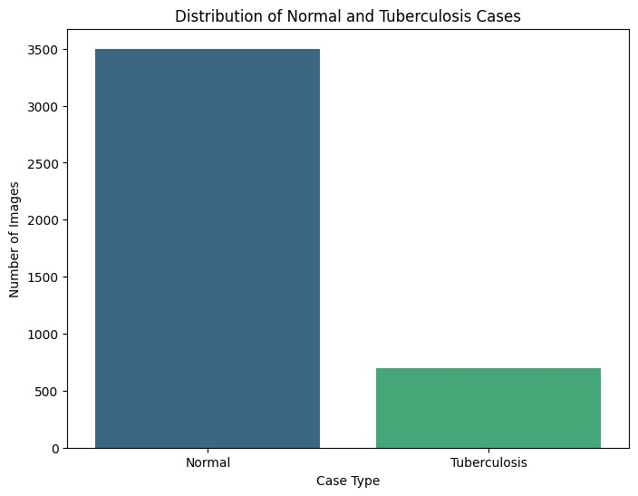
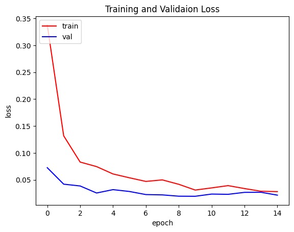
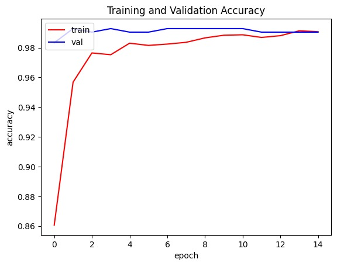
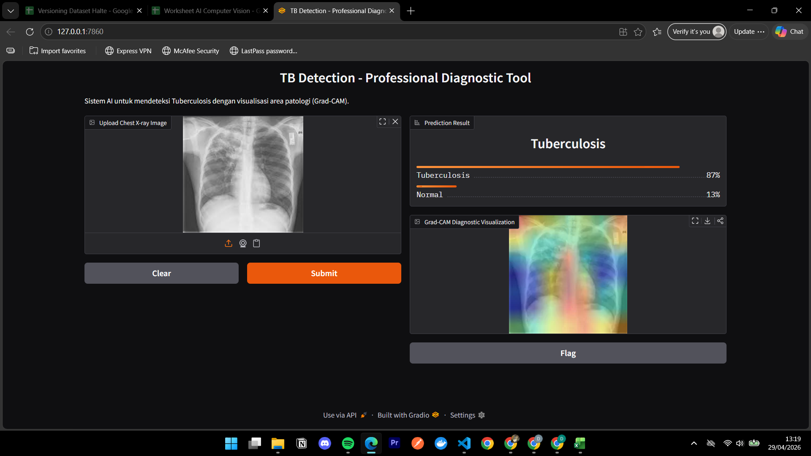
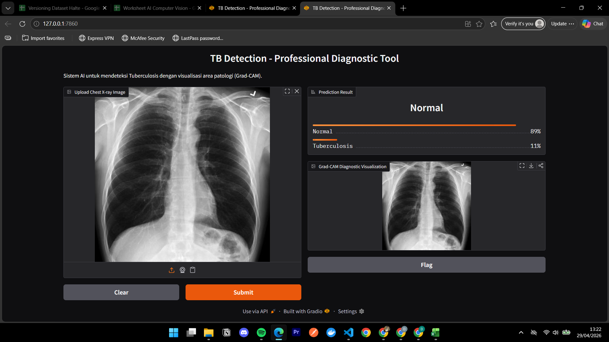

# Tuberculosis Detection from Chest X-Ray 

dataset : https://www.kaggle.com/datasets/tawsifurrahman/tuberculosis-tb-chest-xray-dataset

## Project Overview
Dataset terdiri dari citra X-ray yang terbagi menjadi dua kelas: **Normal** dan **Tuberculosis**. Projek ini memiliki tantangan utama pada ketidakseimbangan data (*imbalanced dataset*), di mana kelas Normal jauh lebih banyak dibanding kelas TB.

### Key Features:
- **Preprocessing:** Resizing (224x224), Rescaling, dan Augmentasi Citra.
- **Model Architecture:** Transfer Learning menggunakan **MobileNetV2** (Pre-trained on ImageNet).
- **Optimization:** Implementasi *Class Weights* untuk menangani data imbalanced.

## Dataset Distribution

Distribusi data sebelum dilakukan splitting:
* **Normal:** ±3500 gambar
* **Tuberculosis:** ±700 gambar

*Note: Digunakan teknik Stratified Splitting untuk menjaga proporsi kelas pada Train (80%), Val (10%), dan Test (10%).*

## Tech Stack
- **Language:** Python
- **Libraries:** TensorFlow/Keras, Scikit-Learn, Matplotlib, Seaborn, Split-folders.
  
## Model Performance
Hasil evaluasi pada **Test Set** menunjukkan performa yang sangat solid:

| Class | Precision | Recall | F1-Score | Support |
| :--- | :--- | :--- | :--- | :--- |
| **Normal** | 0.99 | 1.00 | 0.99 | 350 |
| **TB** | 1.00 | 0.96 | 0.98 | 70 |
| **Accuracy** | | | **99.29%** | 420 |

### Training Logs

  
  

- **Loss:** Tidak menunjukkan indikasi overfitting; kurva Train dan Val menurun secara konvergen.
- **Accuracy:** Stabil di angka >99% pada akhir epoch.

### Detection Result with Grad-CAM Diagnostic Visualization

  
  

